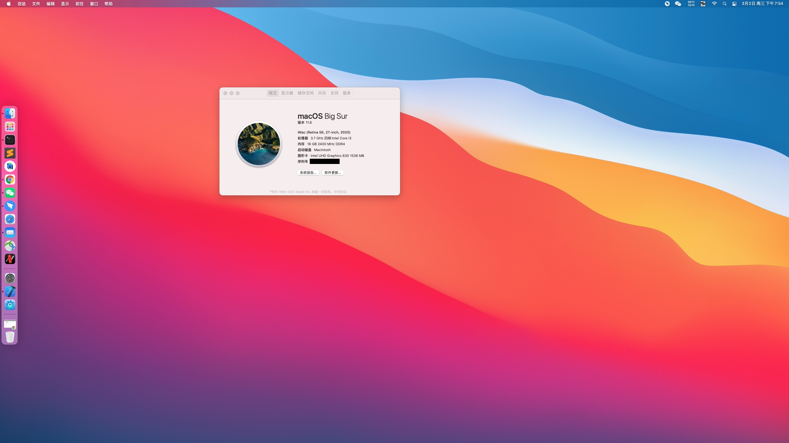

**系统**:  Bigsur 11.6

**主机**:  Dell 3080mff

**网卡**:  BCM943224PCIEBT2

**CPU**:  i3-10105

**内存**:  金士顿DDR4 2666 8Gx2

**硬盘**:  铠侠500G

* 三码已去，需要的小伙伴自己生成；
* 目前系统运行、CPU睿频、核显、隔空、接力、苹果id均正常！睡眠会重启！欢迎喜欢捣鼓的朋友一起研究~

